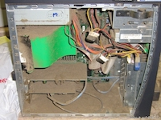

# Blogging Series: Secure Pipelines

## Prerequisites

### Things you should already have (hopefully):
- A computer

- A keyboard

- [Git](https://git-scm.com/)

### Things to start downloading:
- [Kubectl](https://kubernetes.io/docs/tasks/tools/install-kubectl/)

### Things we need to do
- Get everyone access to [Handouts](https://gethandouts.com)

## Code Objectives

- (DONE) [Setup demo repo](docs/demo_project.md)
- (DONE) [Signing Commits](docs/signing_commits.md)
- (DONE) [Verified Commit](docs/verified_commit.md)

## Container Objectives
- (INPROGRESS) [SAST](docs/sast.md): container security scanning
- DAST: container security scanning

## Registry Objectives

- (DONE) [Docker Builds](docs/docker_build.md)
- [Private Registry](docs/private_registry.md)
- A/V: container scanning
- [Signed Images](docs/signed_images.md)
- [Image promotions](docs/image_promotions.md)

# Delivery Objectives

- (DONE) [Create Kubernetes Environment](docs/create_k8s.md)
- [Configure Kubernetes to pull from private registry](docs/private_reg_k8s_config.md)
- [Configure Admission Controls](docs/admission_controls.md)
- [Deploy Bookinfo Project](docs/deploy_bookinfo.md)

## Host Objectives:

- Kubernetes node restrictions
- Taints/Tolerances
- Runtime Security (falco)

## Additional Objectives:

- Patch Management: container build process
- Notary
- Artifact Security (trust model)
- keybase GPG keys
- code quality

We'll be modifying the details page

### Nodes
in a managed solution, access to the Node isn't always permitted, as such you rely on the vendor to keep your nodes up to date. In a non-managed solution it is important to understand how to safetly pull a node out of the cluster, upgrade it and put it back in the cluster.

## Regisry Objectives

### Signed Images

[Docker content trust](https://docs.docker.com/engine/security/trust/content_trust/)

## Aditional Objectives

- [Static Application Security Testing](docs/sast.md)
- [Patch Management](docs/patch_management.md)
- [Using Keybase](docs/keybase.md)
