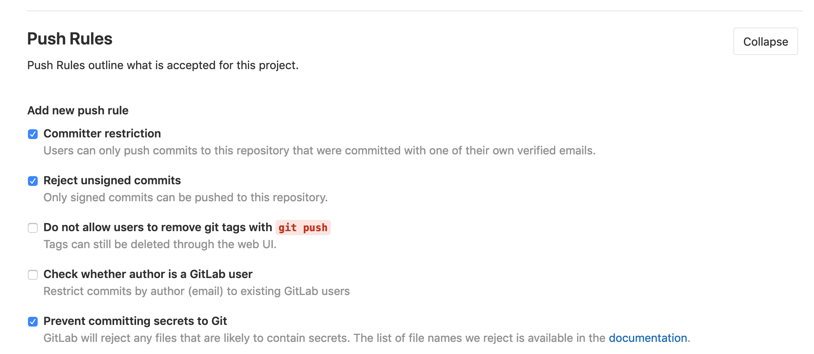

# Blogging Series: Secure Pipelines

Code Objectives:
- signing commits

Container Objectives:
- Patch Management: container build process
- Authenticity: signing
- A/V: container scanning
- Secure/Trusted Delivery: Registry promotion

Host Objectives:
- Kubernetes node

## Code Objectives

### Signing Commits

Signing commits is a way to verify authenticity of the author. This will help us prevent bad actors from injecting code bits into our projects.

__Objectives__
- setup GPG key
- adding GPG key to gitlab account
- associating GPG key with git

#### Setup GPG key
The first step is to generate (or if you already have one, import) a GPG key. The GPG key will be used to associate your identity to gitlab, and verify you as an author of the commits, and code being pushed to the gitlab repository.

[Using Keybase](docs/keybase.md)

##### Generating a new key
Gitlab has some instructions already on how to [generate a GPG key](https://docs.gitlab.com/ee/user/project/repository/gpg_signed_commits/#generating-a-gpg-key) they contain a lot more depth and detail, below is an abbreviated version of what is on that page.

```bash
# instructions and more detail in link provided
# this is the abreviated version
gpg --full-gen-key

 Please select what kind of key you want:
    (1) RSA and RSA (default)
    (2) DSA and Elgamal
    (3) DSA (sign only)
    (4) RSA (sign only)
 Your selection? 1

 RSA keys may be between 1024 and 4096 bits long.
 What keysize do you want? (2048) 4096
 Requested keysize is 4096 bits

 Please specify how long the key should be valid.
          0 = key does not expire
       <n>  = key expires in n days
       <n>w = key expires in n weeks
       <n>m = key expires in n months
       <n>y = key expires in n years
 Key is valid for? (0) 0
 Key does not expire at all

 Is this correct? (y/N) y

 GnuPG needs to construct a user ID to identify your key.

 Real name: Mr. Robot
 Email address: <your_email>
 Comment:
 You selected this USER-ID:
     "Mr. Robot <your_email>"

 Change (N)ame, (C)omment, (E)mail or (O)kay/(Q)uit? O

# export the public key so it can be added to gitlab
gpg --armor --export $(KEY_ID)
```

[Git Signing](https://git-scm.com/book/en/v2/Git-Tools-Signing-Your-Work)
get the ID of your gpg key `gpg --list-signatures` and configure git to use that key
[Gitlab & GPG](https://docs.gitlab.com/ee/user/project/repository/gpg_signed_commits/)

    # had to do this to import keybase pgp key, only for the import
    export GPG_TTY=$(tty)
    # configure git
    git config --global user.signingkey [KEYID]
    git config --global commit.gpgsign true
    # if having issues w/ gpg
    gpgconfg --kill gpg-agent

GPG config for verified in gitlab

    gpg --edit-key [KEYID]
    adduid
    # enter information that matched gitlab
    # list uids and select the one that doesn't match
    uid [NON_MATCHING_ID]
    deluid
    # to remove the other uid
    # also do a trust
    trust
    5
    # only a 5 if you truly trust that key

Config gitlab to only allow approved & verified commits

https://gitlab.com/[GROUP]/[PROJECT]/walkthrough/settings/repository#js-push-rules



when you commit, add in the `-S` tag to make sure you sign the commit

## Patch Management
patch management is the ability to apply software "patches" to your environment. With containerization this is a culmination of two parts - the containers themselves and the nodes they reside on.

Objectives:
- base images
- branch image
- project image
- node updates

### Containers

#### Base Image
alpine FTW

### Nodes
in a managed solution, access to the Node isn't always permitted, as such you rely on the vendor to keep your nodes up to date. In a non-managed solution it is important to understand how to safetly pull a node out of the cluster, upgrade it and put it back in the cluster.


